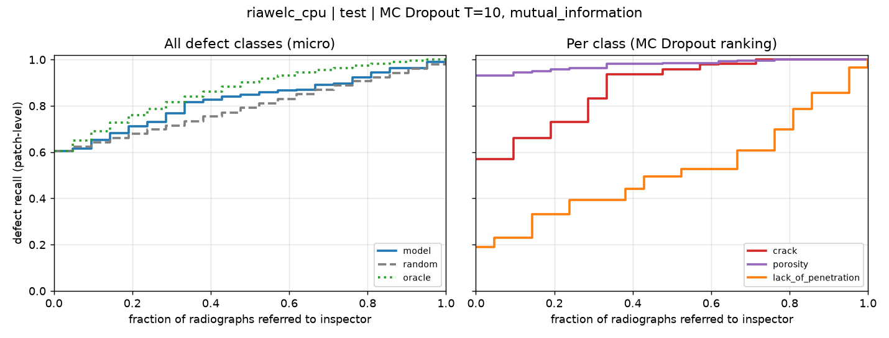

# WeldSight

Weld-defect segmentation on radiographs (NDT) with uncertainty estimation, and a study of
synthetic defects.

**Research question.** Do defects generated by a diffusion inpainting model improve recall on
*rare* defect classes, compared with (a) no defect augmentation and (b) copy-paste augmentation?
All evaluation uses **real radiographs only**.

This repository contains **Stage 1**: data pipeline, EDA, baseline, metrics, uncertainty.
Stages 2–3 are planned in [ROADMAP.md](ROADMAP.md).

## Main findings of Stage 1 (read before using the numbers)

1. **No public dataset has everything we need.** RIAWELC (the only dataset reachable from the dev
   environment) has patch-level class labels but **no masks**. GDXray has masks, but for 10
   radiographs and a single class. SWRD has 6-class polygons, which can be turned into masks,
   and is the recommended main dataset for segmentation and inpainting. Details and licences:
   [docs/DATASETS.md](docs/DATASETS.md).
2. **The split published with RIAWELC leaks.** 108 of 109 radiographs appear in both training and
   testing, and 2,443 files are byte-identical across splits. We deduplicate and re-split by **weld
   specimen** (29 specimens; the test split has 6).
3. **Shortcut in RIAWELC.** No-defect patches are much flatter than defect patches. Patch std alone
   separates them with AUROC 0.91, so "defect vs no-defect" accuracy is not a meaningful headline
   number.
4. **Tiny effective sample size.** The test set has each defect class in only 2–4 specimens, so
   every recall is reported with a 95 % cluster-bootstrap CI over radiographs.

**Dataset decision (2026-09-28): SWRD is the main dataset** for segmentation and for stages 2–3.
It is downloaded from Google Drive inside Colab ([notebooks/03_swrd_gpu.ipynb](notebooks/03_swrd_gpu.ipynb)).
RIAWELC stays as a secondary patch-classification benchmark.

## Setup

```bash
uv sync --extra dev          # Python 3.11, PyTorch, segmentation_models_pytorch
uv run pytest                # 24 tests, ~1 min on CPU
```

Works on CPU, MPS (Apple) and CUDA; the device is chosen automatically (`train.device`).
For a GPU run on Kaggle/Colab use [notebooks/02_train_gpu.ipynb](notebooks/02_train_gpu.ipynb).

## Run

```bash
# 1. data: download RIAWELC, deduplicate, re-split by specimen, resize 227 -> 256
#    (needs `unrar`; on Linux: apt-get install unrar)
uv run weldsight-prepare --config configs/experiment/riawelc_baseline.yaml --download

# 2. train + evaluate on the real test split (MC Dropout)
uv run weldsight-train --config configs/experiment/riawelc_baseline.yaml   # GPU, resnet34/ImageNet
uv run weldsight-train --config configs/experiment/riawelc_cpu.yaml        # CPU, offline
uv run weldsight-train --config configs/experiment/debug.yaml              # 1-minute smoke test

# any config value can be overridden from the CLI
uv run weldsight-train --config configs/experiment/riawelc_baseline.yaml train.lr=1e-4 seed=1

# re-evaluate a finished run (e.g. with more MC samples)
uv run weldsight-eval --run runs/<run_dir> --split test --mc-samples 30
```

SWRD / GDXray: download manually (links in `configs/data/*.yaml`) into `data/raw/swrd` or
`data/raw/gdxray`, check the labels with `weldsight-prepare --config ... --inspect`, then use
`configs/experiment/swrd_baseline.yaml` or `gdxray_baseline.yaml`.

## Reproducibility

- Every setting lives in YAML (`configs/`, with `_base_` inheritance) and can be overridden with `key=value`.
- `weldsight-prepare` writes `dataset_card.json`: counts, the groups in each split, the licence
  and `data_version` (a hash of the manifest). The split is deterministic (`data.split.seed`).
- Each run directory `runs/<experiment>_<timestamp>/` stores the resolved `config.yaml` and
  `provenance.json` (seed, data version, git commit + dirty flag, library versions, device). It
  also holds `history.csv`, `best.pt`, `metrics_test.json`, `results_test.md`,
  `predictions_test.csv` and the referral curve (`referral_test.csv/png`).

## Method

**Data.** Each dataset adapter (`src/weldsight/data/sources.py`) emits records with a
`group_id` (split unit = weld specimen / radiograph) and a `radiograph_id` (referral unit).
Full radiographs are tiled into 256×256 patches; val/test tiles do not overlap. RIAWELC patches
(227×227) are resized. The split is a *stratified group split*: among many random assignments
of groups, it keeps the one closest to 70/15/15 per class and requires every class to appear in
val and test. The tests check that no group or radiograph appears in two splits.

**Model.** `smp.Unet` with a pretrained encoder (resnet34/ImageNet by default), 1-channel input,
and K+1 softmax segmentation outputs. It also has a multi-label patch-classification head (smp
`aux_params`). Loss = Dice + Focal on patches that have masks + focal BCE for the patch head.
With label-only data (RIAWELC) only the patch head is trained, and the decoder is skipped for speed.

**Uncertainty.** Dropout sits on the bottleneck, before the segmentation head and inside the
patch head. At test time it stays active (MC Dropout, T samples; BatchNorm stays in eval mode).
Scores: predictive entropy, expected entropy and mutual information (BALD). For segmentation
they are averaged over the 1 % most uncertain pixels.

**Metrics.**
- Per class: patch-level recall (95 % CI, cluster bootstrap over radiographs), precision, F1,
  AUROC, AP, and radiograph-level recall. With masks, also IoU, pixel recall and
  component (defect-instance) recall.
- **Recall vs. share of radiographs sent to an inspector.** Radiographs are ranked by their
  maximum patch uncertainty and the top f % go to a human. The inspector is assumed to find
  every defect there, so the curve is an upper bound. On the rest only the model's detections
  count. The curve is compared with random referral and an oracle.
- **Error-detection AUROC.** How well the uncertainty separates wrong patches from correct ones.

## Results

### Baseline, RIAWELC (specimen-level split), run `riawelc_cpu`

**Honest scope of this run.** It was trained in an offline 4-core CPU container: ResNet-18 encoder
**without** ImageNet weights (pretrained weights could not be downloaded), 8,000 random train
patches per run, 9 epochs (early stop; best epoch = 5, chosen by val macro-F1). RIAWELC has no
masks, so this is the U-Net's **patch head**, not segmentation, and there is no IoU. It is a
pipeline-validation baseline. The reference baseline is `riawelc_baseline.yaml` (ResNet-34/ImageNet,
full train set, GPU) and then SWRD for segmentation.

Provenance: git `e3dc84c`, data_version `2c33eedecb1697b9`, seed 42, torch 2.14 / smp 0.5.0, CPU.

**Test split** (real radiographs only): 3,073 patches, 21 radiographs, 6 weld specimens.
MC Dropout T = 10, threshold 0.5.

| class | test support (patches / specimens) | recall % (95 % CI) | precision % | F1 | AUROC |
|---|---|---|---|---|---|
| crack | 977 / 2 | **57.0** (52.6–66.7) | 67.0 | 0.62 | 0.86 |
| porosity | 936 / 4 | **93.1** (86.8–97.2) | 93.5 | 0.93 | 0.99 |
| lack of penetration | 658 / 3 | **19.0** (2.3–42.8) | 64.4 | 0.29 | 0.72 |
| macro | | 56.4 | 75.0 | 0.61 | 0.86 |

CI = 95 % cluster bootstrap over test radiographs.

**Validation vs. test gap.** Val macro-F1 was 0.89 (lack-of-penetration recall 0.79), but on
test it is 0.61 (LoP recall 0.19). Both splits contain unseen specimens, so the gap is
specimen-to-specimen variance. With 2–4 specimens per class in each split, one split cannot
estimate generalisation reliably. This is why the ROADMAP proposes specimen-level k-fold CV for
the final comparisons.

**Recall vs. share of radiographs referred to an inspector** (MC Dropout, ranking by mutual
information, radiograph score = max over patches):



| referred radiographs | model | random | oracle |
|---|---|---|---|
| 0 % | 60.4 | 60.4 | 60.4 |
| 10 % | 65.4 | 64.1 | 69.0 |
| 20 % | 71.2 | 67.9 | 75.9 |
| 30 % | 76.8 | 71.5 | 81.5 |
| area under curve | 0.832 | 0.801 | 0.875 |

**How well each uncertainty score flags wrong patches** (AUROC of uncertainty vs. "patch has an
error"): predictive entropy **0.82**, expected entropy 0.82, max-prob 0.80, mutual information
only **0.54**. The pre-registered ranking score (mutual information, the "epistemic" part) carries
almost no error signal here, and its referral curve is only slightly above random. Most errors
come from patches the model is consistently unsure about (aleatoric), not from disagreement
between dropout masks. Switching the score based on this *test* observation would be test-set
tuning. The score should be selected on the validation split (see
`weldsight-eval --split val --uncertainty ...`).

## Repository layout

```
configs/            base.yaml, data/*.yaml (riawelc, swrd, gdxray), experiment/*.yaml
data/               raw/ and processed/ (git-ignored)
docs/DATASETS.md    dataset review, licences, verified facts about RIAWELC
notebooks/          01_eda.ipynb (executed), 02_train_gpu.ipynb, builders, figures/
src/weldsight/
  data/             sources (adapters), patching, split, prepare (CLI), dataset
  models/           unet (WeldUNet + MC dropout), losses (Dice+Focal, focal BCE)
  train/            train (CLI)
  eval/             metrics, uncertainty (MC dropout), referral curve, evaluate (CLI)
  synth/            placeholder for stages 2-3
tests/              patching, split/leakage, prepare (RIAWELC & SWRD formats), model, metrics, smoke
```

## Citation of data

- Totino B., Spagnolo F., Perri S. *RIAWELC: A Novel Dataset of Radiographic Images for Automatic
  Weld Defects Classification.* ICMECE 2022. Perri S. et al. *Welding Defects Classification
  Through a Convolutional Neural Network.* Manufacturing Letters, 2023.
- Mery D. et al. *GDXray: The Database of X-ray Images for Nondestructive Testing.* J. Nondestruct.
  Eval. 34(4), 2015.
- Zhao et al. *SWRD: A Dataset of Radiographic Image of Seam Weld for Defect Detection.*
  J. Nondestruct. Eval. 44, 2025.
